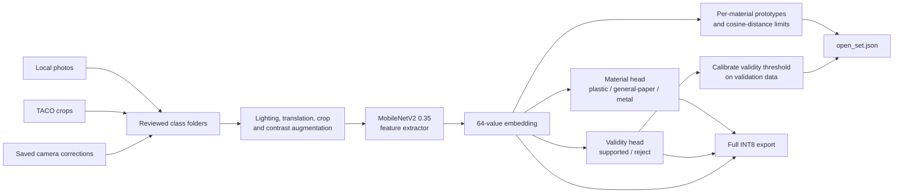
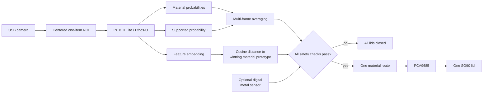

# EcoSort V2 AI architecture

The deployed model remains small and fully integer for the NXP i.MX93. The improvement is not a larger detector: it separates **what material looks most likely** from **whether the image is safe to route at all**.

## Training and export

The `other` images supervise the validity head. They do not become a fourth material competing with plastic, metal, and the middle-bin class. This makes rejection a separate decision and allows the unknown set to grow without changing the three physical routes.

## Live decision path

The gate requires adequate material confidence and margin, a supported probability above the calibrated threshold, a feature distance within the learned class boundary, stable agreement across frames, and camera/sensor agreement when the sensor is enabled.

## Artifact contract

Keep these together when deploying an uncompiled model:

- `waste_classifier_int8.tflite`: material, validity, and embedding outputs.
- `labels.txt`: the three material outputs in exact tensor order.
- `open_set.json`: validity threshold, material prototypes, and distance limits.

When Vela writes the compiled model into a subfolder, pass the original sidecar explicitly with `--metadata artifacts/open_set.json`.
