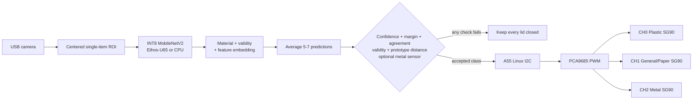

# EcoSort Twin: camera AI + three smart lids

This project implements a single-item recycling prototype for the FRDM-i.MX93:

1. A USB camera sees one item inside the on-screen inspection square.
2. An INT8 MobileNetV2 feature extractor feeds a material head (`plastic`, `general`/`paper`, `metal`) and a supported-item validity head.
3. A cosine-distance check rejects images outside the feature space learned for the three routed materials.
4. Several predictions are averaged; confidence, margin, validity, feature distance, frame agreement, and an optional metal sensor must all agree.
5. Rejected/unknown items keep every lid closed. Accepted items are routed through Linux I2C to a PCA9685 and one 180-degree SG90 lid servo.

There is no trained model file in this folder yet. The supplied pictures show the actuators, not labeled trash examples. Run the camera collector with your real trash, then run `train.py`; it exports an INT8 model ready for Vela and the i.MX93 Ethos-U65.

For the selected first demo: **plastic bottles -> Plastic**, **wrappers -> General**, **metal cans -> Metal**. The `other` class covers empty scenes and unsupported objects. These are visual categories learned from your examples; confidence thresholds alone cannot guarantee rejection of every unfamiliar item.

Windows users can begin with [START_HERE.md](START_HERE.md): double-click `OPEN_CAMERA.cmd`, collect labeled photos, then use `RUN_TRAINING.cmd` and `RUN_DEMO.cmd`.
The complete training and live inference charts are in [AI_ARCHITECTURE.md](AI_ARCHITECTURE.md).



## Fastest camera test (works before training)

Plug the Logitech/USB camera into the **laptop** for data collection. TensorFlow 2.18 requires Python 3.10–3.12; Python 3.14 is too new. Install Python 3.12 if needed, then from this folder run:

```powershell
python --version
python -m venv .venv
.\.venv\Scripts\Activate.ps1
python -m pip install -r requirements-camera.txt
python dataset_studio.py --camera 0 --middle general
```

If `python --version` is not 3.10–3.12, create the environment with a Python 3.12 executable, for example `py -3.12 -m venv .venv`. If the picture does not appear, try `--camera 1`.

Hold exactly one item inside the green square and press:

| Key | Saved class |
|---|---|
| `1` | Plastic |
| `2` | General (or paper when `--middle paper`) |
| `3` | Metal |
| `0` | Other / unsafe / unknown |
| `Q` | Quit |

Change the item, angle, distance, background, and lighting. Include empty views, hands, food, glass, electronics, and multiple objects in `other`. A first prototype needs at least 300 varied images per class; 800–1500 per class is better. Do not mix both `paper` and `general` in one model.

`general` must mean only the approved, non-hazardous waste you intentionally want in the middle bin (for example a clean snack wrapper under your demo rules). `other` means “do not route”: an empty scene, hand, battery, electronics, glass, liquid/food, multiple objects, or anything unsupported.

## Train the actual waste model

With the same Python 3.12 environment:

```powershell
python -m pip install -r requirements-train.txt
python train.py --data data --output artifacts
```

For a three-class dataset containing only `plastic`, `metal`, and exactly one of
`general`/`paper`, train a classification-only model explicitly:

```powershell
python train.py --data dataset --output artifacts --allow-no-other
```

The three-class model works for saved-image classification and dry-run camera testing, but
live lid actuation remains blocked until the training data includes a representative `other`
class. The trainer applies inverse-frequency class weights by default; pass
`--no-class-balance` only when the dataset is already balanced or deliberately sampled.

For a credible hackathon accuracy number, collect a second session on a different background or day with `python dataset_studio.py --output validation_data`, then train with `--validation-data validation_data`. This prevents neighboring webcam frames from appearing in both training and validation. The simple command above uses a reproducible 80/20 file split for quick experiments.

### Add reviewed TACO examples

The TACO importer downloads the official reviewed COCO annotations and images, converts them
into padded classifier crops, keeps license/source provenance, skips crops that are too small
to be useful, creates conservative background negatives, and combines them with the original
dataset using hard links when the filesystem supports them:

```powershell
python scripts\import_taco.py
python train.py --data dataset_enhanced --output artifacts_v2
```

The generated `dataset_enhanced/taco_import_report.json` records the category mapping and
counts; `taco_import_manifest.jsonl` records the source URL and license ID for every crop.
The mapping deliberately sends glass, batteries, and ambiguous composite items to `other`, and
omits TACO's `Unlabeled litter` category rather than assigning an unreliable material label.

When an `other` folder is present, the trainer now builds EcoSort V2 by default. `other` trains a binary validity head instead of competing with the material classes. The trainer calibrates a validity threshold from validation data and records per-material feature prototypes and cosine-distance limits. Use `--legacy-single-head` only to reproduce the older four-class model.

The trainer uses ImageNet transfer learning, reproducible train/validation partitions, augmentation, fine-tuning, class balancing, full INT8 quantization, and a second evaluation of the exported TFLite file. Outputs:

```text
artifacts/best.keras
artifacts/labels.txt
artifacts/open_set.json
artifacts/saved_model/
artifacts/waste_classifier_int8.tflite
artifacts/training_summary.json
```

`labels.txt` contains only the three routed material labels for a V2 model. `open_set.json` contains the calibrated reject threshold and feature prototypes and must travel with the model. `training_summary.json` reports the confusion matrix, per-class precision/recall/F1, macro F1, unknown false-acceptance rate, and wrong-lid activation rate. If results are weak, collect more varied examples and inspect mistakes; do not lower safety thresholds just to make the demo trigger.

To retrain the enhanced dataset without overwriting the older artifact until you have tested it:

```powershell
.\.venv\Scripts\python.exe train.py `
  --data dataset_enhanced `
  --output artifacts_v2 `
  --epochs 15 `
  --fine-tune-epochs 5
```

## Camera demo on the laptop

First prove classification without moving hardware:

```powershell
python -m ecosort_ai.app `
  --model artifacts\waste_classifier_int8.tflite `
  --labels artifacts\labels.txt `
  --camera 0 `
  --dry-run
```

Press Space to classify and Q to quit. For the polished multi-frame demo, run:

```powershell
python -m ecosort_ai.live_demo `
  --model artifacts_v2\waste_classifier_int8.tflite `
  --labels artifacts_v2\labels.txt `
  --camera 0 `
  --frames 7 `
  --threshold 0.75 `
  --agreement 0.80 `
  --dry-run
```

The V2 metadata is auto-detected when `open_set.json` is beside the model. The overlay displays material confidence, supported probability, feature distance, frame agreement, route/rejection state, and runtime/delegate. Space analyzes manually; `A` arms one automatic analysis; `P/G/M/O` saves the current ROI under `corrections/` for later review and retraining; Q/Escape quits. Auto pauses after every result so one item cannot repeatedly command the servos. It stays in dry-run unless `--live --i2c-bus BUS_NUMBER` is explicitly supplied.

If the board exposes an already-configured digital metal detector as a readable value file, add `--metal-sensor-path /sys/class/gpio/gpioN/value`. Add `--metal-sensor-active-low` when electrical low means detected. The demo only reads this input; GPIO direction, pin mux, voltage compatibility, and pull resistors must be configured safely in the BSP/device tree first. A camera/sensor disagreement closes all lids.

For a saved photo:

```powershell
python -m ecosort_ai.app --model artifacts\waste_classifier_int8.tflite --labels artifacts\labels.txt --image test.jpg --dry-run
```

## Supplied servo and PCA9685 hardware

Choose the **180-degree positional SG90**, not the 360-degree continuous-rotation option shown in the store listing. A continuous servo interprets PWM as direction/speed and cannot hold a lid angle.

| PCA9685 channel | Lid |
|---:|---|
| 0 | Plastic |
| 1 | General or paper (middle) |
| 2 | Metal |

The PCA9685 board is only the pulse generator. It does not provide servo power. Use a regulated 5 V supply with enough startup/stall current for the servos, current limiting or a fuse, and a common ground.

Conceptual wiring (confirm the current board revision and header orientation first):

```text
FRDM P12 pin 1, 3.3 V   -> PCA9685 VCC (logic and breakout pull-ups)
FRDM P12 pin 6, GND     -> PCA9685 GND
FRDM P12 pin 7, I3C_SCL -> PCA9685 SCL (used in I2C-compatible mode)
FRDM P12 pin 9, I3C_SDA -> PCA9685 SDA (used in I2C-compatible mode)

External regulated 5 V + -> PCA9685 V+ servo terminal
External regulated 5 V - -> PCA9685 GND (common with FRDM)

Servo signal -> channel 0/1/2 PWM
Servo +5 V   -> V+
Servo ground -> GND
```

Keep PCA9685 `VCC` at **3.3 V** so breakout-board I2C pull-ups do not pull the FRDM bus to 5 V. Never feed the external servo rail into the FRDM. Power everything off before rewiring and do not trust wire colors without checking the supplier.

## Safe servo bring-up

On the i.MX93, identify the P12 controller instead of guessing a bus number:

```sh
i2cdetect -l
i2cdetect -y BUS_NUMBER 0x40 0x40
```

Start with **servo horns/linkages removed**. This command only previews the requested pulse:

```sh
python3 -m ecosort_hw.calibrate --channel 0 --pulse-us 1500
```

After confirming wiring, add `--live --bus BUS_NUMBER`. Test 1500 microseconds first, then move in small 50-microsecond steps while staying within 900–2100 microseconds. Disconnect power immediately if the servo buzzes, stalls, heats, or hits a stop.

Copy `hardware.example.json` to `hardware.json`, then enter the safe closed/open pulse measured for each channel. Reversed mounting is supported: for example, a lid may close at 1850 microseconds and open at 950 microseconds.

Test the complete controller in simulation:

```sh
python3 -m ecosort_hw --dry-run --hardware-config hardware.json --dwell 0
```

After mounting very light lids and verifying the mechanism manually, test only one destination:

```sh
python3 -m ecosort_hw --live --lid plastic --bus BUS_NUMBER --hardware-config hardware.json --dwell 1
```

The fallback defaults use 1000-microsecond closed and 1833-microsecond open commands, but your measured `hardware.json` values take precedence. The selected open lid remains powered during the dwell. A separate timer commands closure even if camera capture stops progressing; exiting the controller also commands closure. This is software scheduling, not an independent hardware watchdog or physical confirmation of lid position.

This prototype still has **no physical E-stop, lid switches, jam detection, or independent watchdog**. Software cannot guarantee closure after a power, wire, or I2C failure. Use lightweight normally-closed lids, mechanical stops, keep hands clear, and never run it unattended.

## Compile for the i.MX93 NPU

Copy this folder, the model, and labels to the board. Use the Vela version included with the target BSP:

```sh
cd /opt/ecosort
sh scripts/compile_vela.sh artifacts/waste_classifier_int8.tflite artifacts/vela
python3 board_check.py
```

The output normally ends in `_vela.tflite`. The runtime searches common BSP paths for `libethosu_delegate.so` and prints whether inference selected CPU or the Ethos-U delegate.

For the board demo, plug the USB camera into the **i.MX93 board**, then run from a Weston terminal or SSH:

```sh
export XDG_RUNTIME_DIR=/run/user/0
export WAYLAND_DISPLAY=wayland-0
export DISPLAY=:0

python3 -m ecosort_ai.live_demo \
  --model artifacts/vela/waste_classifier_int8_vela.tflite \
  --labels artifacts/labels.txt \
  --metadata artifacts/open_set.json \
  --camera 0 \
  --frames 7 \
  --threshold 0.75 \
  --agreement 0.80 \
  --live \
  --hardware-config hardware.json \
  --i2c-bus BUS_NUMBER
```

Use `--dry-run` while proving the camera/model. Physical movement is deliberately available only through the multi-frame runner. The simpler `ecosort_ai.app --headless` command is useful for classification checks over SSH, but remains dry-run only.

## i.MX93 architecture note

The Cortex-A55 runs Linux, camera capture, the application, UI, networking, and I2C control. The Ethos-U65 runs the compiled classifier. NXP's Ethos-U stack may already rely on Cortex-M33 firmware and RPMsg, so do not replace that firmware with a generic servo example; that can break NPU inference. A later safety MCU/M33 integration must coexist deliberately with the NXP firmware architecture.

## Final demo checklist

1. Camera dataset contains real items and a strong `other` class.
2. Quantized validation accuracy and real tabletop tests are acceptable.
3. Unknown/ambiguous objects demonstrably keep every lid closed.
4. Vela report and runtime output confirm the Ethos-U delegate.
5. Correct I2C bus and address are verified.
6. Every servo is calibrated unloaded, then with one lightweight lid.
7. Only one lid moves at a time and returns closed.
